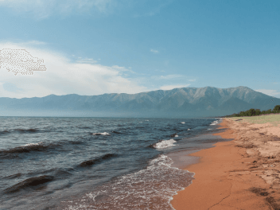

# Проект: Путешествие по России


### Обзор
* Описание
* Структура
* Примеры оформления

**Описание**

Одностраничный сайт от [**Яндекс.Практикум**](https://practicum.yandex.ru/) с графическим офрмлением, описывающий некоторые из самых живописных мест России, интересные факты и рассказы о путешествиях по России. 
Ссылка: **(https://Vitaliy23Nikolaenko.github.io/russian-travel/index.html)** 

**Структура**

Сайт включает в себя следующие **секции**:

**1.** Шапка сайта (**header**) с логотипом и меню выбора языка.

**2.** Секция **lead** с заголовком, иллюстрацией и небольшой статьей о большом потенциале страны для путешествий.

**3.** Секция **photo-grid** c небольшой галереей из различных туристических мест.

  

**4.** Секция **places**, включающая 5 статей об известных местах для путешествий: Куршская Коса, Кольский полуостров, Байкал, Алтай, Карелия. Для каждой локации представлены иллюстрация, небольшое описание и ссылка на интернет-ресурсы, посвященные локации.

**Куршская коса**

      


**5.** Секция **cover** с иллюстрацией и ссылкой на авторский ресурс с записями о путешествии до Байкала на электричках.

**6.** Секция **footer** с ссылками на ресурсы, которые могут понадобиться для планирования путешествия:

* [**Яндекс.Карты**](https://yandex.ru/maps);
* [**Яндекс.Погода**](https://yandex.ru/pogoda);
* [**Яндекс.Расписание**](https://rasp.yandex.ru);
* [**Яндекс.Календарь**](https://calendar.yandex.ru);
* [**Яндекс.Путешествия**](https://travel.yandex.ru);

Сайт реализован с помощью **HTML** и **СSS**.

```
<div class="place">
          <h2 class="place__title">Алтай</h2>
          <div class="place__website">
            <p class="place__url-heading">URL</p>
            <a href="https://www.youtube.com/watch?v=7ZEsoV7kWAQ" target="_blank" rel="nofollow noreferrer" class="place__link">Youtube</a>
          </div>
          
          <div class="place__description">
            <p class="place__paragraph">
              Алтай&nbsp;&mdash; одно из&nbsp;красивейших мест в&nbsp;России.
              В&nbsp;первую очередь из-за гор: если ехать вдоль хребта,
              вы&nbsp;увидите склоны, усыпанные соснами, горные реки
              и&nbsp;озёра. А&nbsp;если вы&nbsp;откроете в&nbsp;автомобиле окна,
              сможете познакомиться с&nbsp;невидимым чудом здешних
              мест&nbsp;&mdash; горным воздухом.
            </p>
            <p class="place__paragraph">
              Климат на&nbsp;Алтае умеренный, поэтому ехать сюда лучше всего
              летом. Так вы&nbsp;увидите всё разнообразие местной флоры
              и&nbsp;фауны. По&nbsp;лесам Алтая бродят лоси, над хребтами летают
              орлы, а&nbsp;на&nbsp;равнинах пасутся косули. И&nbsp;знаменитые
              манулы&nbsp;&mdash; тоже обитатели Алтайского края.
            </p>
          </div>
```
